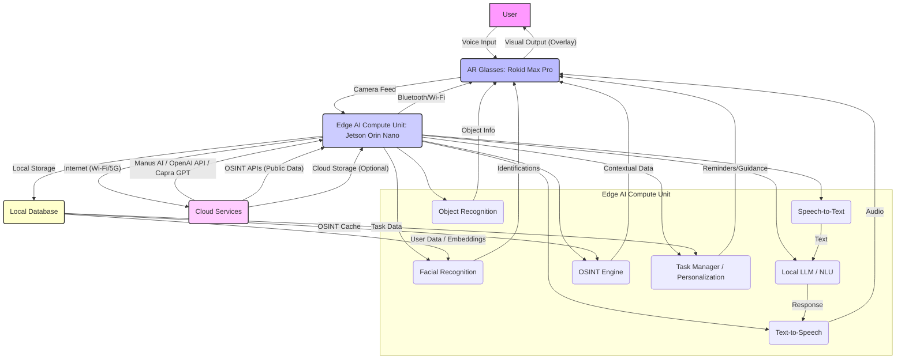

# AI Smart Glasses: Budget-Optimized Architecture Design

## 1. Introduction

This document outlines a budget-optimized hardware and software architecture for AI smart glasses with advanced capabilities, including real-time facial recognition, object recognition, OSINT (Open Source Intelligence) integration, and a Jarvis-like AI assistant experience. The design prioritizes cost-effectiveness for prototyping and future productization, while ensuring robust functionality and adherence to legal and ethical considerations for data handling.

## 2. Core Requirements

Based on the user's input, the key requirements for the AI smart glasses are:

*   **Real-time Visual Overlays:** Google Maps-like navigation, information display.
*   **Facial Recognition:** Real-time identification of individuals, including name and potential workplace, using public data sources.
*   **Object Recognition:** Identification and contextual information for objects in the environment.
*   **AI Assistant (Jarvis-like):** Voice-controlled interaction, daily task management, guided life suggestions based on past data.
*   **OSINT Capabilities:** Integration with open-source intelligence for contextual information.
*   **Manus AI Integration:** Leveraging Manus AI for advanced agent capabilities.
*   **Budget-Friendly:** Cost-effective for prototyping and scalable for product development.
*   **Legal Compliance:** Strict adherence to data privacy and usage laws, especially for facial recognition.
*   **Prototype for Business:** Designed for eventual commercialization.

## 3. Hardware Architecture

To achieve a balance between functionality and budget, a hybrid approach combining off-the-shelf AR glasses with a powerful, yet cost-effective, edge computing unit is recommended. The initial focus will be on a solution that allows for rapid prototyping and iteration.

### 3.1. AR Glasses (Head-Mounted Display)

| Component | Model Suggestion | Pros | Cons | Estimated Cost (USD) |
| :-------- | :--------------- | :--- | :--- | :------------------- |
| **Primary AR Glasses** | **Rokid Max Pro + Rokid Station** | - OLED waveguide, spatial AR, lightweight, stealthy. - Good balance of features and cost. - Android-based Station for companion processing. | - Requires companion device for full AI processing. - May not have dual cameras like Vuzix Shield. | $700 - $1,000 |
| *Alternative (Budget DIY)* | *Custom Raspberry Pi 5 + Micro-OLED Display* | - Maximum cost control and customization. - Full control over hardware and software. | - Significant engineering effort for display integration and form factor. - Less refined user experience out-of-the-box. | $150 - $300 (components only) |

**Rationale:** The Rokid Max Pro offers a compelling balance for a prototype, providing a ready-to-use AR display with an Android-based companion device (Rokid Station) that can handle some local processing and act as a hub for the edge AI unit. This reduces the complexity of building a custom display solution while keeping costs significantly lower than high-end enterprise AR glasses like the Vuzix Shield. The Raspberry Pi 5 alternative is noted for extreme budget constraints but requires substantial development effort.

### 3.2. Edge AI Compute Unit

This unit will perform the heavy lifting for real-time AI processing, including facial recognition, object recognition, and running the core AI assistant logic.

| Component | Model Suggestion | Pros | Cons | Estimated Cost (USD) |
| :-------- | :--------------- | :--- | :--- | :------------------- |
| **Edge AI Processor** | **NVIDIA Jetson Orin Nano Developer Kit** | - Excellent performance for AI/ML tasks at the edge. - Optimized for deep learning models (YOLO, ArcFace). - Good developer community and ecosystem. - Low power consumption for portable use. | - Higher cost than a Raspberry Pi. - Requires active cooling for sustained high loads. | $199 - $499 (depending on version) |
| *Alternative (Extreme Budget)* | *Raspberry Pi 5 (with Coral AI Accelerator)* | - Very low cost. - Versatile for general computing. - Coral AI Accelerator boosts ML inference. | - Lower raw AI performance than Jetson. - More complex setup for AI acceleration. | $60 - $100 (Pi 5) + $25 (Coral) |

**Rationale:** The NVIDIA Jetson Orin Nano is chosen as the primary edge AI unit due to its superior performance in AI inference, which is crucial for real-time facial and object recognition. It provides a robust platform for deploying deep learning models. A Raspberry Pi 5 with a Coral AI accelerator is a viable, even cheaper alternative, but might require more optimization for real-time performance.

### 3.3. Connectivity & Power

*   **Connectivity:** Bluetooth Low Energy (BLE) for communication between AR glasses and the edge AI unit (for overlay data), Wi-Fi for internet connectivity (OSINT, cloud AI services, Manus AI). Tailscale VPN for secure mesh networking, as suggested in the provided documents.
*   **Power:** High-capacity USB-C power banks (e.g., 20,000mAh+) to power both the AR glasses and the Jetson unit for extended operation.

## 4. Software Architecture

The software stack will be designed to be modular, allowing for easy updates and integration of new AI models or OSINT sources.

### 4.1. Operating System

*   **Edge AI Unit:** Ubuntu Linux (standard for Jetson/Raspberry Pi, robust for development).
*   **AR Glasses (Rokid Station):** Android (allows for custom companion app development).

### 4.2. Core AI Modules

| Module | Description | Technologies/Models | Data Sources | Legal Considerations |
| :----- | :---------- | :------------------ | :----------- | :------------------- |
| **Facial Recognition** | Real-time detection and identification of faces. | - **Detection:** YOLOv8 (for bounding boxes). - **Embedding:** ArcFace, FaceNet. - **Matching:** Faiss (for similarity search in large databases). | - **Publicly available datasets:** Labeled Faces in the Wild (LFW), CelebA. - **OSINT sources:** Public social media profiles, news articles, public records (e.g., LinkedIn for workplace). | - **Crucial:** Only use publicly available and legally accessible data. - Implement strict data retention policies. - Obtain explicit consent if used in private settings. - Anonymize or hash data where possible. |
| **Object Recognition** | Identification of objects and provision of contextual information. | - YOLOv8 (pretrained models or fine-tuned). - CLIP (for zero-shot object recognition). | - COCO, ImageNet datasets. - Wikipedia, product databases (e.g., OpenFoodFacts, GS1). | - Generally less restrictive, but avoid identifying private property without consent. |
| **OSINT Integration** | Gathering and presenting open-source intelligence. | - Python libraries: `requests`, `BeautifulSoup` (web scraping, with caution). - APIs for public data: Twitter API (for public tweets), Google Maps API, public news APIs. - Custom web crawlers for specific public databases. | - Publicly accessible websites, social media, news archives, government databases. | - Adhere to terms of service for all APIs and websites. - Respect `robots.txt` directives for web scraping. - Data aggregation must comply with privacy laws. |

### 4.3. AI Assistant (Jarvis-like)

*   **Voice Interface:** Speech-to-text (e.g., Whisper, Google Speech-to-Text API) for user input, Text-to-speech (e.g., Google Text-to-Speech API, Coqui TTS) for responses.
*   **Natural Language Understanding (NLU) / Generation (NLG):**
    *   **Local LLM (Budget-Friendly):** Fine-tuned open-source models like Llama 3 (8B) or Mistral 7B, running on the Jetson Orin Nano. This provides privacy and reduces API costs.
    *   **Cloud LLM (Advanced):** Integration with **Manus AI** (via API) for more complex reasoning, creative tasks, and access to broader knowledge. Also, potential integration with **ChatGPT** (via OpenAI API) and **Capra GPT** (if it becomes publicly available and suitable).
*   **Personalization & Task Management:** Local database (e.g., SQLite) to store user preferences, daily schedules, and past interactions. AI will analyze this data to provide guided suggestions and manage tasks.

### 4.4. Data Management & Storage

*   **Local Database:** SQLite or PostgreSQL on the Jetson unit for storing facial embeddings, object metadata, user profiles, daily tasks, and OSINT caches. This minimizes reliance on cloud services and enhances privacy.
*   **Cloud Storage (Optional/Encrypted):** For backup or synchronization of non-sensitive data, or encrypted sensitive data (e.g., anonymized facial embeddings), using services like AWS S3 or Google Cloud Storage, with strong encryption.
*   **Palantir Integration (Future):** While Palantir typically works with large, structured datasets for government and enterprise, for a prototype, conceptual integration would involve defining data schemas that could eventually feed into a Palantir-like system for advanced analytics, assuming access is granted or a similar open-source alternative is used.

### 4.5. System Architecture Diagram

## 5. Budget-Friendly Considerations

*   **Hardware:** Prioritizing Rokid Max Pro for AR glasses and Jetson Orin Nano for edge AI offers a strong performance-to-cost ratio for prototyping. Exploring open-source hardware alternatives like Raspberry Pi for extreme budget constraints.
*   **Software:** Leveraging open-source AI models (YOLOv8, ArcFace, Llama 3) for core functionalities reduces licensing costs. Using local LLMs on the edge device minimizes reliance on expensive cloud API calls.
*   **Data:** Strictly adhering to public data sources for OSINT and facial recognition avoids costly data acquisition and legal complexities associated with private datasets.
*   **Development:** Focusing on Python for AI and backend logic, and Android for the companion app, leverages widely available developer tools and communities.

## 6. Next Steps

1.  **Detailed Component List:** Generate a precise list of hardware components with links and exact pricing.
2.  **Software Stack Deep Dive:** Outline specific libraries, frameworks, and APIs for each software module.
3.  **GitHub Repository Setup:** Create a repository structure with initial documentation and placeholder code for the architecture.
4.  **Business Plan Development:** Draft a comprehensive business plan, including market analysis, financial projections, and funding strategies.
5.  **Legal Framework:** Develop a detailed legal compliance strategy for data collection, processing, and usage, focusing on public data sources.
6.  **Presentation Materials:** Prepare content and slides for investor pitches and stakeholder communication.

This architecture provides a solid foundation for building a functional, budget-friendly prototype of AI smart glasses with advanced capabilities, keeping future productization and legal compliance in mind.
